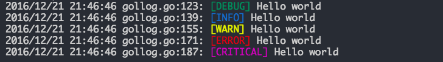

# gol: a high performance async log kit for golang

[](https://golang.org)
[](https://travis-ci.org/philchia/gol)
[](https://coveralls.io/github/philchia/gol?branch=master)
[](https://goreportcard.com/report/github.com/philchia/gol)
[](https://godoc.org/github.com/philchia/gol)
[](https://opensource.org/licenses/MIT)

gol is a high performance async log infrastructure for golang, which include several useful log backend adapters, include file/file rotate/stmp/slack/elasticsearch etc...

## Introduce

### Level

gol support various log levels, you can set the logger's level to disable some lower level output

```go
const (
    ALL LogLevel = iota
    DEBUG
    INFO
    WARN
    ERROR
    CRITICAL
)
```

### Built in adapters

gol has several built in adapters

- Console adapter support write log to stderr, and this is the default adapter
- File adapter support write log to file
- File rotate adapter support write log to rotate files **Imcomplete**
- Stmp adapter support write log to email **Imcomplete**
- Slack adapter support write log to given slack channel **Imcomplete**
- ES adapter support write log to elastic search **Imcomplete**

### Customize backend adapters

You can create any backend adapter which implement the Adapter interface.

Actually Adapter is a alias of io.Writer

```go
type Adapter interface {
    io.WriteCloser
}
```

### Color

gol also include a colorful output



## Usage

### Log to console

```go
import (
    "github.com/philchia/gol"
    "runtime"
)

defer gol.Flush()
gol.Debug("Hello, gol!!!")
gol.Criticalf("Hello from %s", runtime.GOOS)

```

### Log to file

```go
import (
    "github.com/philchia/gol"
    "runtime"
)

defer gol.Flush()
gol.AddLogAdapter("file", file.NewAdapter("/var/log/tmp.log"))
gol.Debug("Hello, gol!!!")
gol.Criticalf("Hello from %s", runtime.GOOS)

```

### Set level

```go
import (
    "github.com/philchia/gol"
    "runtime"
)

defer gol.Flush()
gol.SetLevel(gol.ERROR)
gol.Debug("Hello, gol!!!") // this will not print
gol.Criticalf("Hello from %s", runtime.GOOS)

```

### Set options

```go
import (
    "github.com/philchia/gol"
    "runtime"
)

defer gol.Flush()
gol.SetOption(gol.Llongfile | gol.Ldate | gol.Ltime | gol.Lmicroseconds)
gol.Debug("Hello, gol!!!")
gol.Criticalf("Hello from %s", runtime.GOOS)

```

### Add adapters

You can implement you own custom adapters which implement the Adapter interface.

```go
import (
    "github.com/philchia/gol"
    "runtime"
)

defer gol.Flush()
gol.SetOption(gol.Llongfile | gol.Ldate | gol.Ltime | gol.Lmicroseconds)
gol.AddLogAdapter("anonymous", a)
gol.Debug("Hello, gol!!!")
gol.Criticalf("Hello from %s", runtime.GOOS)
```

## Installation

    $go get github.com/philchia/gol

or you can use `go get -u` to update the package

## Documentation

For docs, see [Documentation](http://godoc.org/github.com/philchia/gol "GoDoc")  or run:

    $godoc github.com/philchia/gol

## Features

- [X] Log level support
- [X] Customizable log option support
- [X] Async write
- [X] Colorful output
- [X] Flush buffered log
- [X] Toggle console adapter
- [ ] Level support for single adapter
- [ ] Logrotate
- [ ] Mail adapter
- [ ] Slack adapter
- [ ] Elastic Search adapter for ELK stack
- [ ] 100% coverage [](https://coveralls.io/github/philchia/gol?branch=master)

## License

gol code is published under the MIT license